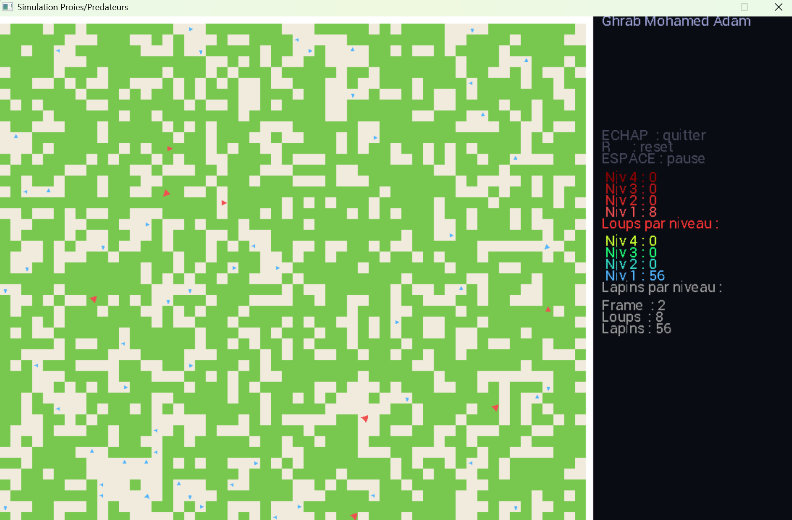
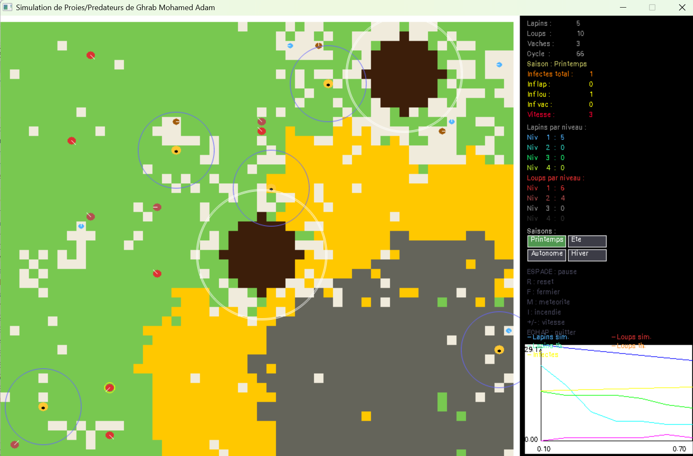
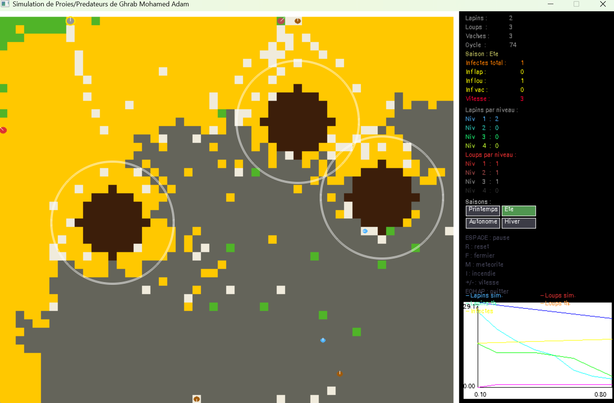
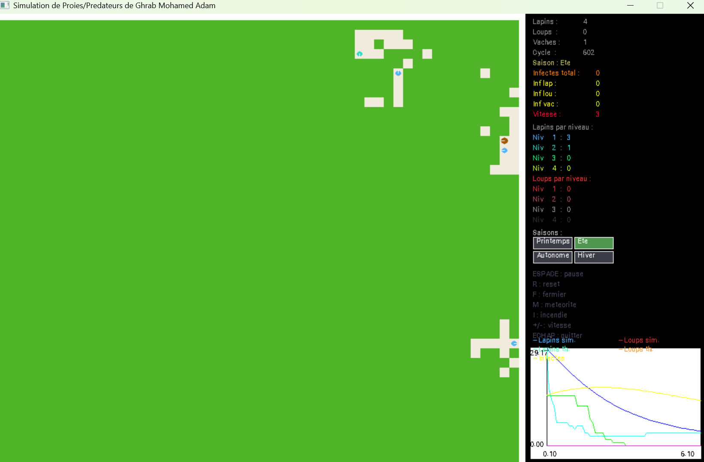

# Simulation Proies / Prédateurs — Lotka-Volterra

> Projet de fin de semestre — UE LIFAMI — Université Lyon 1 UCBL  
> **Ghrab Mohamed Adam** — p2406783

---

## Démonstration vidéo

▶️ **[Voir la simulation en action sur YouTube](https://youtu.be/VnwFoeqomjY)**

La vidéo montre le comportement de la simulation : changements de saison, placement de fermiers, météorites, incendies, évolution des populations et des courbes en temps réel.

---

## Présentation

Simulation d'un écosystème proies/prédateurs inspirée du **modèle mathématique de Lotka-Volterra**.  
Trois espèces animales coexistent sur une grille 2D de **54 × 46 cases** :

| Espèce | Rôle | Couleur |
|--------|------|---------|
| 🐇 Lapins | Proies — mangent l'herbe | Bleu → Jaune selon le niveau |
| 🐺 Loups | Prédateurs — chassent lapins et vaches | Rouge → Gris selon le niveau |
| 🐄 Vaches | Bétail — source d'énergie élevée | Marron |

Chaque animal est un **disque coloré avec une ligne blanche** indiquant sa direction. Les populations évoluent en temps réel et sont comparées aux prédictions mathématiques de Lotka-Volterra.

---

## Screenshots

**Début de simulation** — 25 lapins (bleus), 15 loups (rouges), 7 vaches (marron), panneau avec courbes :



**Météorites + Fermiers + Incendie simultanés** — cratères marron, cercles bleus des fermiers, feu jaune/orange, cercles jaunes = animaux infectés :



**Incendie massif + Cendres** — le feu (orange/rouge) laisse des cendres grises, les animaux fuient. On voit les fermiers protégeant leurs zones :


**Incendie + Météorite + courbes** — plusieurs catastrophes simultanées, les courbes montrent la chute des populations :



**Quasi-extinction en été + courbes LV** — 4 lapins survivants, loups éteints, courbes bleue (simulée) vs cyan (théorique Lotka-Volterra) :



---

## Fonctionnalités

- **Système de niveaux 1 à 4** — lapins : via échappements aux loups / loups : via repas
- **Meutes de loups** — formation dynamique de 3 loups niveau 3 proches, dissolution si séparation
- **4 saisons cliquables** — modifient la pousse de l'herbe, la reproduction, la vision des loups et l'énergie
- **Modèle SIR** — épidémie contagieuse avec comptage séparé par espèce (lapins / loups / vaches)
- **Fermiers** — zones de protection placées au clic, les loups fuient et perdent de l'énergie
- **Météorites** — cratère immédiat + onde de choc progressive repoussant les animaux
- **Incendies** — propagation cellulaire (double buffer), fuite intelligente, propagation doublée en été
- **5 courbes temps réel** — lapins/loups simulés + lapins/loups théoriques LV + infectés
- **Vitesse réglable** — touches `+` et `6` de 1 à 10

---

## Contrôles

| Touche | Action |
|--------|--------|
| `ESPACE` | Pause / Reprendre |
| `R` | Réinitialiser |
| `F` + clic | Placer un fermier (max 5) |
| `M` + clic | Lancer une météorite (max 3) |
| `I` + clic | Démarrer un incendie |
| `+` | Accélérer la simulation |
| `6` | Ralentir la simulation |
| Boutons saisons | Changer la saison dans le panneau droit |
| `ECHAP` | Quitter |

---

## Compilation

Ce projet utilise la bibliothèque **Grapic** de l'Université Lyon 1 (basée sur SDL2).

```bash
make
./simulation
```

> Grapic doit être installé selon les instructions de l'UE LIFAMI.  
> Documentation Grapic : https://alexandre.meyer.pages.univ-lyon1.fr/grapic/

---

## Structure du projet

```
LIFAMI-project/
├── doc/
│   ├── ARCHITECTURE.md           # Structs, fonctions, algorithmes
│   ├── MODELES_SCIENTIFIQUES.md  # Lotka-Volterra, SIR, automate cellulaire
│   ├── CHANGELOG.md              # Historique des dépôts
├── experiments/
│   ├── README.md                 # Historique du développement
├── screenshots/                  # Captures de la version finale
├── src/
│   └── simulation.cpp            # Code source (~2100 lignes)
└── README.md
```

---

## Modèles scientifiques

### Lotka-Volterra
```
dN/dt = α·N − β·N·P      (proies)
dP/dt = δ·N·P − γ·P      (prédateurs)
```
Intégré par la **méthode d'Euler** (TD6-7 LIFAMI). Les courbes théoriques sont superposées aux courbes simulées pour comparer le modèle mathématique au comportement réel.

### Modèle SIR
```
SAIN → INFECTÉ (200 cycles) → RÉTABLI (400 cycles) → SAIN
```
Contagion par contact (rayon 2 cases, 8%/cycle) et par prédation (100%).

### Automate cellulaire — Incendie
Propagation case par case avec **double buffer** — même principe que le Jeu de la Vie (TD9 LIFAMI).

---

## Références

- Modèle de Lotka-Volterra : https://fr.wikipedia.org/wiki/Equations_de_Lotka-Volterra
- Modèle SIR : https://fr.wikipedia.org/wiki/Modeles_compartimentaux_en_epidemiologie
- Bibliothèque Grapic Lyon 1 : https://alexandre.meyer.pages.univ-lyon1.fr/grapic/
